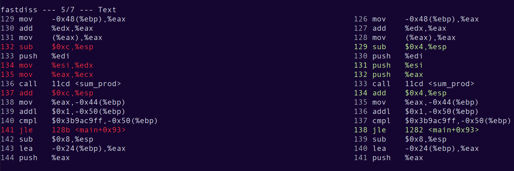
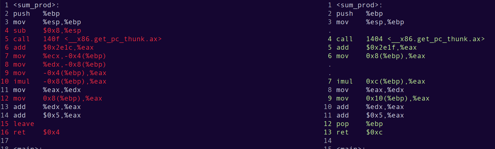
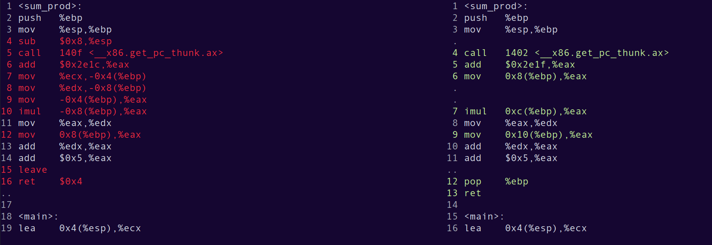
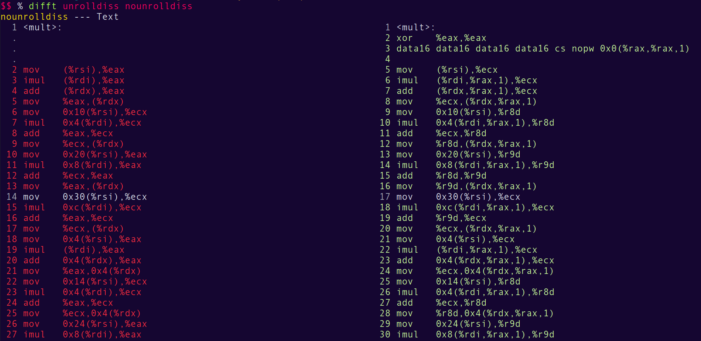

# НИЯУ МИФИ 2023. 
# Практические аспекты разработки высокопроизводительного программного обеспечения. 
## Соколов Александр, Б20-505.

## Используемая система

<pre>
System:
  Kernel: 6.3.7-arch1-1 arch: x86_64 bits: 64 compiler: gcc v: 13.1.1
    Desktop: MATE v: 1.26.1 Distro: Arch Linux
CPU:
  Info: quad core model: AMD Ryzen 5 3500U with Radeon Vega Mobile Gfx
    bits: 64 type: MT MCP arch: Zen/Zen+ note: check rev: 1 cache: L1: 384 KiB
    L2: 2 MiB L3: 4 MiB
  Speed (MHz): avg: 1487 high: 2100 min/max: 1400/2100 boost: enabled cores:
    1: 1400 2: 1400 3: 1400 4: 1400 5: 2100 6: 1400 7: 1400 8: 1400
    bogomips: 33550
  Flags: avx avx2 ht lm nx pae sse sse2 sse3 sse4_1 sse4_2 sse4a ssse3 svm

GCC: 13.1.1 20230429
clang: 15.0.7
</pre>

## Соглашения о вызове функций

Стандартные соглашения о вызове функций, такие как stdcall, fastcall, cdecl и vectorcall, определяют способ передачи параметров функции и очистки стека после вызова.

- stdcall
    - Параметры функции передаются через стек в обратном порядке (первый параметр последним).
    - Функция вызывающая очищает стек после вызова.
    - Используется в WinAPI для функций Windows.

- fastcall
    - Часть параметров (обычно первые) передается через регистры процессора (обычно регистры общего назначения).
    - Остальные параметры передаются через стек.
    - Функция вызывающая очищает стек после вызова.
    - Обычно приводит к более эффективному использованию регистров и ускорению вызова функций.

- cdecl 
    - Параметры функции передаются через стек в прямом порядке (первый параметр первым).
    - Очистка стека выполняется функцией вызывающей.
    - Широко используется в С/С++ и является соглашением по умолчанию.

### Сравнение соглашений о вызове
    
Была разработана программа для вычисления некоторого выражения, которая должны была выделить особенности каждого из соглашений. 

```C
#include <stdio.h>
#include <stdlib.h>
#include <time.h>

int __attribute__((cdecl)) sum_prod(int x, int y, int z){
    return x * y + z + 5;
}

int main(){
    int b, tmp;
    srand(0xab0ba); 
    int* vals = (int*)calloc(20, sizeof(int));
    for(int i = 0; i < 20; i++){
        vals[i] = rand();
    }

    struct timespec t, t1, t2;
    clock_gettime(CLOCK_PROCESS_CPUTIME_ID, &t1);

    for(b = 0; b < 1e9; b++){
        tmp = sum_prod(vals[(7 * b) % 20], vals[(7 * b + 1) % 20], vals[(7 * b + 2) % 20]);//, vals[(7 * b + 3) % 20]);
    }

    clock_gettime(CLOCK_PROCESS_CPUTIME_ID, &t2);
    t.tv_sec=t2.tv_sec-t1.tv_sec;
    
    if((t.tv_nsec = t2.tv_nsec - t1.tv_nsec) < 0){
        t.tv_sec--;
        t.tv_nsec += 1000000000;
    }

    double result = t.tv_sec + t.tv_nsec / 1e9;
    

    printf("Elapsed: %g\n", result / 1e9);
    free(vals);
    return 0;
}
```

#### Результаты выполнения программ:

```
./fastcall.out
Elapsed: 8.53251e-09
./fastcalllO3.out
Elapsed: 1.653e-15

./stdcall.out
Elapsed: 8.97562e-09
./stdcalllO3.out
Elapsed: 1.763e-15

./cdecl.out
Elapsed: 8.54874e-09
./cdeclO3.out
Elapsed: 1.332e-15
```

В данном примере отличия по времени были минимальны, возможно это из-за выбранной функции. 

#### Сравнение ассемблерных листингов

- fastcall vs stdcall





Основным отличием является то, что при fastcall значения кладутся в регистры, а при stdcall кладутся на стек.

- stdcall vs cdecl

 

# исправить

#### vectorcall

- Специфично для компилятора MSVC (Microsoft Visual C++).
Оптимизировано для работы с SIMD-инструкциями (Single Instruction, Multiple Data).
- Параметры передаются через регистры процессора, а также могут использоваться SIMD-регистры.
- Используется для оптимизации работы с векторными типами данных.
- Важно отметить, что выбор соглашения о вызове может влиять на производительность, совместимость и портабельность кода. Он должен соответствовать используемому компилятору и платформе.

### Использование констант

Когда переменная объявляется как const, компилятор может принять ряд оптимизаций:

- Компилятор может заменить использование константных значений в коде на их фактические значения. Например, если у вас есть const int x = 5; и в коде используется x * 2, компилятор может заменить это выражение на 10 во время компиляции.
- Компилятор может провести оптимизации на уровне компиляции, такие как фолдинг констант (constant folding). Это означает, что компилятор может выполнить математические вычисления во время компиляции и заменить результатом константу. Например, если у вас есть const int x = 3 + 4; и в коде используется x * 2, компилятор может заменить это выражение на 14 во время компиляции.
- Компилятор может провести дополнительные оптимизации, связанные с использованием константных переменных, такие как устранение неиспользуемого кода или устранение лишних проверок условий.


### Сравнение времени

```C
#include <stdio.h>
#include <stdlib.h>
#include <time.h>

int sum_prod(int x, int y, int z){
    return x * y + z + 5;
}

int main(){
    int b, tmp;
    srand(0xab0ba); 
    int* vals = (int*)calloc(20, sizeof(int));
    for(int i = 0; i < 20; i++){
        vals[i] = rand();
    }

    struct timespec t, t1, t2;
    clock_gettime(CLOCK_PROCESS_CPUTIME_ID, &t1);

    const int l = 1e9;
    for(b = 0; b < l; b++){
        tmp = sum_prod(vals[(7 * b) % 20], vals[(7 * b + 1) % 20], vals[(7 * b + 2) % 20]);//, vals[(7 * b + 3) % 20]);
    }

    clock_gettime(CLOCK_PROCESS_CPUTIME_ID, &t2);
    t.tv_sec=t2.tv_sec-t1.tv_sec;
    
    if((t.tv_nsec = t2.tv_nsec - t1.tv_nsec) < 0){
        t.tv_sec--;
        t.tv_nsec += 1000000000;
    }

    double result = t.tv_sec + t.tv_nsec / 1e9;
    

    printf("Elapsed: %g\n", result / 1e9);
    free(vals);
    return 0;
}
```

```
./noconst.out
Elapsed: 9.23235e-09

./const.out
Elapsed: 8.95795e-09
```

Разницы не видно, дифф файлов показал, что они одинаковые.

### Разыменовывание указателя

```C
#include <stdio.h>
#include <stdlib.h>
#include <time.h>

typedef struct aboba{
    int x;
    int y;
    char z;
} aboba;

void modify(aboba* st){
    st->x = 1;
    st->y = 2;
    st->z = 3;
} 

aboba creat(aboba st){
    st.x = 1;
    st.y = 2;
    st.z = 3;
    return st;
}


int main(){
    int b;
    aboba s;
    s.x = 0;
    s.y = 0;
    s.z = 0;

    struct timespec t, t1, t2;
    clock_gettime(CLOCK_PROCESS_CPUTIME_ID, &t1);
    
    for(b = 0; b < 1e9; b++){
        s = creat(s);
    }

    clock_gettime(CLOCK_PROCESS_CPUTIME_ID, &t2);
    t.tv_sec=t2.tv_sec-t1.tv_sec;
    
    if((t.tv_nsec = t2.tv_nsec - t1.tv_nsec) < 0){
        t.tv_sec--;
        t.tv_nsec += 1000000000;
    }

    double result = t.tv_sec + t.tv_nsec / 1e9;

    printf("Elapsed nop: %g\n\n", result / 1e9);

    s.x = 0;
    s.y = 0;
    s.z = 0;

    clock_gettime(CLOCK_PROCESS_CPUTIME_ID, &t1);
    
    for(b = 0; b < 1e9; b++){
        modify(&s);
    }

    clock_gettime(CLOCK_PROCESS_CPUTIME_ID, &t2);
    t.tv_sec=t2.tv_sec-t1.tv_sec;
    
    if((t.tv_nsec = t2.tv_nsec - t1.tv_nsec) < 0){
        t.tv_sec--;
        t.tv_nsec += 1000000000;
    }

    result = t.tv_sec + t.tv_nsec / 1e9;

    printf("Elapsed p: %g\n\n", result / 1e9);

    return 0;
}
```

Результаты:

```
./a.out
Elapsed nop: 1.2202e-08

Elapsed p: 3.05525e-09
```

Как мы видим, функция, использующая указатели отработала примерно в 4 раза быстрее.

На больших структурах стоит ожидать увеличение разницы. Однако иногда копирование может быть быстрее.

### Векторизация 

```C
#include <stdio.h>
#include <time.h>
#include <stdlib.h>


void mult(int* A, int* B, int* C){
#pragma clang loop vectorize(assume_safety)
    for(int i = 0; i < 4; i++){
        for(int j = 0; j < 4; j++){
            for(int k = 0; k < 4; k++){
                C[i * 4 + j] += A[i * 4 + k] * B[k * 4 + j];
            }
        }
    }
//#pragma clang loop unroll_count(4)
}

int main(){
    int b;
    int A[16] = {1, 2, 3, 4, 5, 6, 7, 8, 9, 10, 11, 12, 13, 14, 15, 16};
    int B[16] = {21, 46, 18, 43, 75, 17, 96, 68, 55, 66, 59, 12, 26, 54, 38, 100};
    int* C = (int*)calloc(16, sizeof(int));
    int* tmp;

    struct timespec t, t1, t2;
    clock_gettime(CLOCK_PROCESS_CPUTIME_ID, &t1);
    
    for(int i = 0; i < 1e8; i++){
        mult(A, B, C);
    }

    clock_gettime(CLOCK_PROCESS_CPUTIME_ID, &t2);
    t.tv_sec=t2.tv_sec-t1.tv_sec;
    
    if((t.tv_nsec = t2.tv_nsec - t1.tv_nsec) < 0){
        t.tv_sec--;
        t.tv_nsec += 1000000000;
    }

    double result = t.tv_sec + t.tv_nsec / 1e9;

    printf("Elapsed: %g\n\n", result);
    free(C);
    return 0;
}
```

Замеры времени выполнялись на функции, которая перемножает матрицы.
Векторизировать в данной функции можно скалярное умножение(3й цикл).

#### Результаты

```
clang main.c 2>/dev/null && ./a.out
Elapsed: 20.0526


clang -O3 main.c 2>/dev/null && ./a.out
Elapsed: 3.11644


clang -O3 main.c 2>/dev/null && ./a.out
Elapsed: 2.22478
```

Разница довольно существенная

#### Разворачивание

Перпробовав все варианты разворачивания трех циклов, результат был одним и тем же. Полученное время почти не отличалось от обычной оптимизации, однако разворачивание в ней не происходило:


